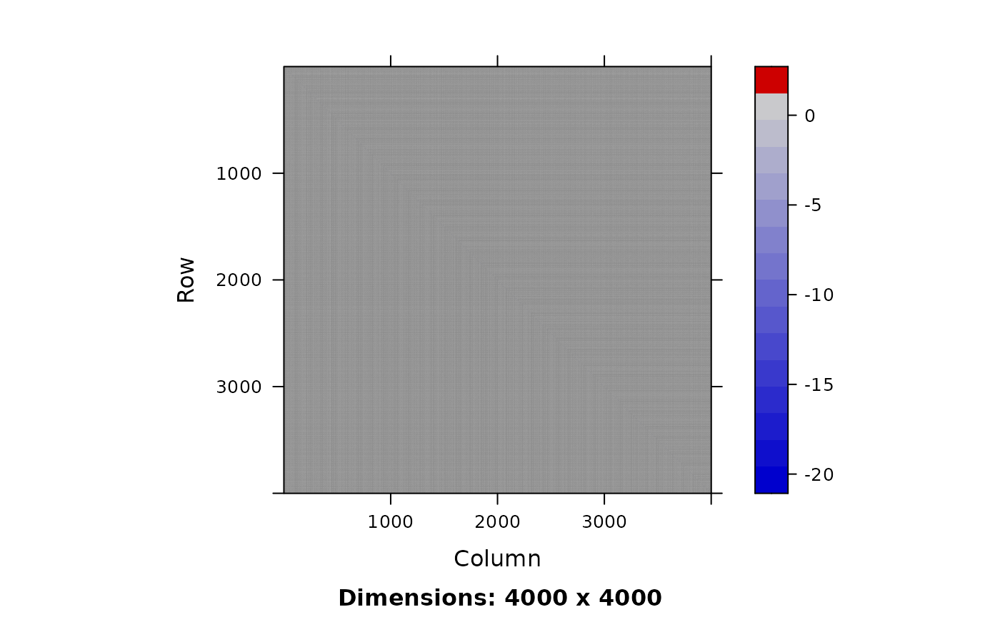
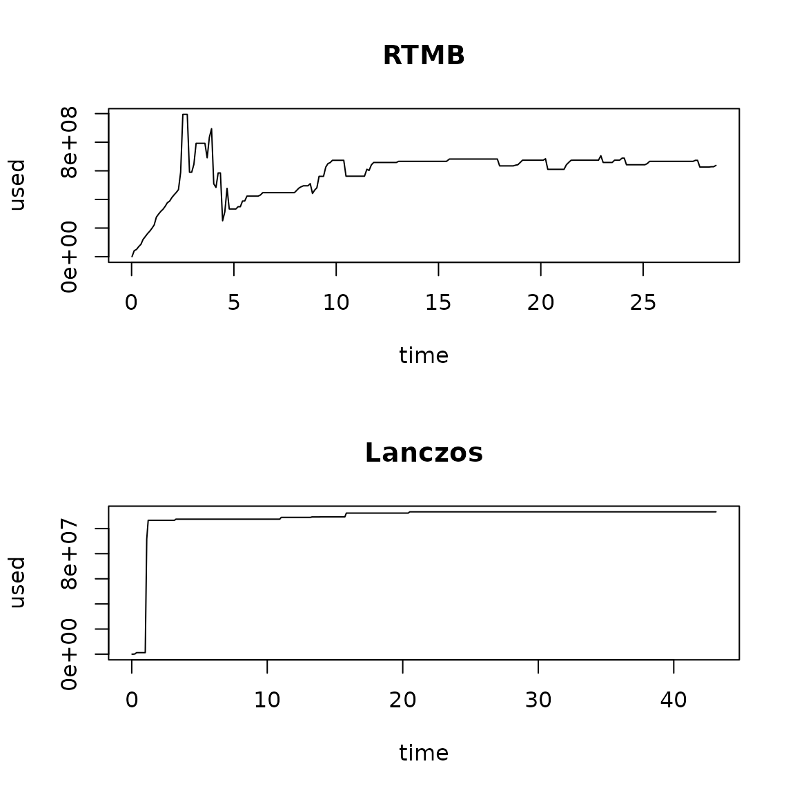

# Lanczos methods for penalized and marginal likelihood models

This vignette demonstrates how Lanczos methods can be used to
approximate standard errors and epsilon bias-correction for penalized
likelihood models, without directly forming or inverting the Hessian
matrix representing associations among random effects.

``` r

library(Matrix)
library(RTMB)
library(lanczosRTMB)
library(numDeriv)
library(memprof)
```

## Generalized linear mixed model

We first demonstrate Lanczos methods using a simple generalized linear
mixed model.

### Simulate from a GLMM

We first simulate data from a compound lognormal-Gamma process:

``` r

set.seed(123)
n = 30
n_sum = 3

# log-linked normal deviates
u = 0 + rnorm(n)

# Conditional gamma process
y = rgamma( n, shape = 1/0.5^2, scale = exp(u) * 0.5^2 )
```

We then define a function to compute the joint likelihood, while also
allowing us to calculate other outputs for later use:

``` r

nll = function(p){
  sumexpu = sum(exp(p$u[seq_len(n_sum)]))
  ADREPORT( sumexpu )
  REPORT( sumexpu )
  nll1 = dnorm(p$u, mean=p$mu, sd=exp(p$logsd), log=TRUE)
  nll2 = dgamma( 
    y, 
    shape = 1/exp(2*p$logcv), 
    scale = exp(p$u) * exp(2*p$logcv), 
    log=TRUE
  )
  jnll = -1 * ( sum(nll1) + sum(nll2) )
  if(what == "jnll") return(jnll)
  if(what == "sumexpu") return(sumexpu)
  if(what == "biascorr") return(jnll + p$eps * sumexpu)
}

# Starting list of parameters
parlist = list(u=u*0, mu = 0, logsd = 0, logcv = 0, eps = 0)
```

Finally, we fit this model as a log-linked generalized linear mixed
model (GLMM):

``` r

# Build RTMB object
what = "jnll"
obj = RTMB::MakeADFun( 
  nll, 
  parlist,
  map = list(eps = factor(NA)),
  random = "u",
  silent = TRUE
)

# optimize 
opt = nlminb( obj$par, obj$fn, obj$gr )
opt
#> $par
#>         mu      logsd      logcv 
#> -0.1052225 -0.1326400 -0.5984998 
#> 
#> $objective
#> [1] 36.46907
#> 
#> $convergence
#> [1] 0
#> 
#> $iterations
#> [1] 13
#> 
#> $evaluations
#> function gradient 
#>       17       14 
#> 
#> $message
#> [1] "relative convergence (4)"
```

### Fit as marginal likelihood without Cholesky decomposition

We first show that we can re-fit the model using the marginal
likelihood, evaluated using Hutchinson-Lanczos instead of the Cholesky
factorization that is default in TMB:

``` r

parlist$eps = numeric()
pen0 = lanczos_MakeADFun(
  nll, 
  parlist,
  random = "u",
  k = 10,
  silent = TRUE
)

# optimize 
opt_pen0 = nlminb( pen0$par, pen0$fn )
opt_pen0
#> $par
#>         mu      logsd      logcv 
#> -0.1051230 -0.1327639 -0.5981617 
#> 
#> $objective
#> [1] 36.46907
#> 
#> $convergence
#> [1] 1
#> 
#> $iterations
#> [1] 25
#> 
#> $evaluations
#> function gradient 
#>       51      110 
#> 
#> $message
#> [1] "false convergence (8)"
```

### Fit as a penalized likelihood model

Next, we show that the model can be refitted using penalized likelihood,
conditional upon fixed values for variance parameters:

``` r

# Define RTMB object for penalized likelihood
newmap = list(
  mu = factor(NA), 
  logsd = factor(NA), 
  logcv = factor(NA),
  eps = factor(NA)
)
pen = RTMB::MakeADFun( 
  nll, 
  obj$env$parList(), 
  map = newmap,
  silent = TRUE
)

# Re-optimize
opt_pen = nlminb( pen$par, pen$fn, pen$gr )
```

Alternatively, we provide a Newton optimizer using a truncated conjugate
gradient, which operates using Hessian-vector products without ever
forming the full Hessian matrix:

``` r

# Extract tape and make Hessian-vector-product function
tape = GetTape(pen)
Hq = make_Hq( tape, pen$par )

# run Newton optimizer
opt_pen2 = newton_CG(
  par = pen$par,
  fn = tape,
  gr = tape$jacfun(),
  Hq = Hq
)
#> value: 41.78943 mgc: 9.836576e-13 ustep: 0.9999
```

We can then use stochastic trace estimation and the Lanczos method to
approximate the log-determinant of the Hessian for random effects:

``` r

# log-determinant using Lanczos
Hq = make_Hq( GetTape(pen), opt_pen$par )
lanczos_logdet( Hq, k = 10, m = 3 )
#> [1] 44.4956 44.4956 44.4956

# log-determinant for marginal likelihood
H = obj$env$spHess(par = obj$env$last.par.best, random = TRUE)
Matrix::determinant( H )$modulus
#> [1] 44.4956
#> attr(,"logarithm")
#> [1] TRUE
```

Using this log-determinant, we can also compare the log-marginal
likelihood using Lanczos with the full calculation:

``` r

# Marginal likelihoods using Lanczos
lanczos_nll( pen, k = 10, m = 10 )
#>      nll   sd_nll 
#> 36.46907  0.00000

# Marginal likelihood using Laplace
opt$obj
#> [1] 36.46907
```

### Delta methods

Alternatively, we can apply Lanczos methods to standard errors for
parameters. Here, we will sample the first three random effects

``` r

samples = lanczos_sample(
   Hq = Hq,
   q = c( rep(1,3), rep(0,n-3) ),
   k = 30,
   n = 1000,
   orthogonalize = TRUE
)

#
sdrep = sdreport( obj, ignore.parm.uncertainty = TRUE )
as.list(sdrep, what = "Std. Error")$u[1:3]
#> [1] 0.4839019 0.4864751 0.4066186
apply( samples, MARGIN = 1, FUN = sd)[1:3]
#> [1] 0.4782002 0.4887318 0.4051458
```

Alternatively, we can apply Lanczos methods to approximate the Hessian
with respect to a derived quantity. This involves calculating the
gradient for the derived quantity with respect to coefficients:

``` r

what = "sumexpu"
grad = RTMB::MakeADFun( 
  nll, 
  obj$env$parList(), 
  map = newmap,
  silent = TRUE
)$gr( pen$par )[1,]
```

We can then use this gradient to approximate samples from the Hessian
matrix and use that to calculate a Monte Carlo estimator for standard
errors:

``` r

samples = lanczos_sample(
   Hq = Hq,
   q = grad,
   k = 30,
   n = 1000,
   orthogonalize = TRUE
)

# Compare SD of samples with the delta method
sumexpu1 = apply( samples, MARGIN = 2, FUN = \(v)pen$report(v)$sumexpu )
c( pen$report()$sumexpu, sd(sumexpu1) )
#> [1] 4.0641214 0.9435151
summary(sdrep)['sumexpu',]
#>   Estimate Std. Error 
#>   4.064121   1.194484
```

Alternatively, we can calculate the standard error for a derived
quantity using Lanczos within the delta method:

``` r

# 
Var = lanczos_variance(
  Hq = Hq,
  q = grad,
  k = 3
)

# Compare with the delta method
c( pen$report()$sumexpu, sqrt(Var) )
#> [1] 4.064121 1.194484
summary(sdrep)['sumexpu',]
#>   Estimate Std. Error 
#>   4.064121   1.194484
```

### Epsilon methods

Finally, we can use the gradient of the log-likelihood with respect to a
dummy variable epsilon to correct for retransformation bias:

``` r

# One-sided finite difference
what = "biascorr"
phat = obj$env$parList()
phat$eps = 0.0001
pen_hi = RTMB::MakeADFun( 
  nll, 
  parameters = phat, 
  map = newmap,
  silent = TRUE
)

# Re-optimize
opt_hi = optim( 
  pen_hi$par, pen_hi$fn, pen_hi$gr, 
  method = "L-BFGS-B", control = list(factr = 1e-2) 
)

# Calculate marginal nll for finite-difference
nll_hi = lanczos_nll( pen_hi, k = 10, m = 10, seed = 123 )
nll_mid = lanczos_nll( pen, k = 10, m = 10, seed = 123 )

# Epsilon bias-correction estimator
sdrep = sdreport( obj, bias.correct = TRUE )

#
(nll_hi['nll'] - nll_mid['nll']) / (phat$eps)
#>      nll 
#> 4.733918
summary(sdrep)['sumexpu',]
#>            Estimate          Std. Error Est. (bias.correct) Std. (bias.correct) 
#>            4.064121            1.625808            4.734025                  NA
```

## Spatial change of support

Next, we fit a model that involves spatial change of support, which
breaks sparsity in the inner Hessian. We again simulate data from the
change-in-support process:

``` r

# Settings
set.seed(123)
nx = 20
ny = 100
rho = 0.9

# Simulate AR1 process approaching random walk (i.e., ill-conditioned inner problem)
Px = bandSparse( n = nx, k = c(-1,1), diagonals = list(rep(0.5,nx),rep(0.5,nx)) )
Py = bandSparse( n = ny, k = c(-1,1), diagonals = list(rep(0.5,ny),rep(0.5,ny)) )
Ix = Diagonal(n=nx)
Iy = Diagonal(n=ny)
Qx = (Ix - rho * t(Px)) %*% (10 * Ix) %*% (Ix - rho * Px)
Qy = (Iy - rho * t(Py)) %*% (10 * Iy) %*% (Iy - rho * Py)
Q = kronecker( Qy, Qx )
x = RTMB:::rgmrf0( n= 1, Q = Q )[,1]
y = rpois( nx*ny, lambda = exp(1 + x) )
which_seen = sample( seq_len(nx*ny), size = nx*ny/100, replace = FALSE)
sumy = sum(y)
#y[-which_seen] = NA
```

We then define the joint likelihood that includes a term for the total
across samples:

``` r

nll = function(p){
  Qx = (Ix - plogis(p$invlogis_rho) * t(Px)) %*% (exp(2*p$logtau) * Ix) %*% (Ix - plogis(p$invlogis_rho) * Px)
  Qy = (Iy - plogis(p$invlogis_rho) * t(Py)) %*% (exp(2*p$logtau) * Iy) %*% (Iy - plogis(p$invlogis_rho) * Py)
  Q = kronecker( Qy, Qx )
  loglik1 = dgmrf(p$x, Q = Q, log = TRUE)
  loglik2 = sum(dpois(y, exp(p$mu + p$x), log=TRUE), na.rm=TRUE)
  loglik3 = dnorm(log(sumy), log(sum(exp(p$mu + p$x))), sd = 0.01, log = TRUE)
  -1 * ( loglik1 + loglik2 + loglik3 )
}
parlist = list( x=rnorm(nx*ny), logtau = 0, invlogis_rho = 0, mu = 0 )
```

We then fit this as normal in RTMB:

``` r

start_time = Sys.time()
obj_RTMB = MakeADFun(
  nll,
  parlist,
  random = "x",
  silent = TRUE
)
fit_RTMB = with_monitor(
  nlminb(
    obj_RTMB$par,
    obj_RTMB$fn,
    obj_RTMB$gr,
    control = list(trace = 1)
  )
)
#>   0:     4896.9817:  0.00000  0.00000  0.00000
#>   1:     4744.2389: 0.124996 -0.00447820 0.00946536
#>   2:     4679.9923: 0.245742 0.0121629 0.0390854
#>   3:     4594.2388: 0.249049 0.194179 0.211695
#>   4:     4482.8581: 0.573575 0.433051 0.510630
#>   5:     4356.6401: 0.554924 0.894201 0.707435
#>   6:     4296.1381: 0.838862  1.23350 0.944071
#>   7:     4284.3847: 0.893045  1.64946 0.668795
#>   8:     4281.7613:  1.03619  1.81783 0.595935
#>   9:     4272.0508: 0.995248  1.76388 0.818554
#>  10:     4269.1172:  1.03526  1.79489 0.993948
#>  11:     4266.3980:  1.07658  1.97263 0.999180
#>  12:     4266.0792:  1.09196  2.01230  1.05816
#>  13:     4266.0688:  1.09441  2.02035  1.07004
#>  14:     4266.0688:  1.09501  2.02192  1.07024
#>  15:     4266.0688:  1.09492  2.02178  1.07028
#>  16:     4266.0688:  1.09492  2.02178  1.07026
fit_RTMB$run_time = Sys.time() - start_time
```

We can see that the Hessian is dense:

``` r

Matrix::image( obj_RTMB$env$spHess(random=TRUE) )
```



Alternatively, we can fit this using Lanczos methods, which are less
sensitive to the lack-of-sparsity. Here, we avoid constructing the
gradient of the Laplace-Lanczos approximation to the log-marginal
likelihood, pending improvements:

``` r

start_time = Sys.time()
obj = lanczos_MakeADFun(
  nll,
  parlist,
  random = "x",
  k = 40,
  make_gr = TRUE,
  silent = TRUE
)
fit_lanczos = with_monitor(
  nlminb(
    obj$par,
    obj$fn,
    \(x) obj$gr(x, method = "simple"),
    control = list(trace = 1)
  )
)
#>   0:     4889.9395:  0.00000  0.00000  0.00000
#>   1:     4731.3154: 0.127391 -0.00430648 0.00945274
#>   2:     4664.2376: 0.250415 0.0134343 0.0392316
#>   3:     4574.0909: 0.254062 0.201644 0.212175
#>   4:     4449.6320: 0.585331 0.457210 0.505993
#>   5:     4317.8220: 0.572487 0.943031 0.664725
#>   6:     4241.6747: 0.867865  1.33917 0.795902
#>   7:     4233.7632: 0.913843  1.76282 0.513434
#>   8:     4207.2454:  1.15432  2.20977 0.575037
#>   9:     4197.9785:  1.17504  2.14093  1.08121
#>  10:     4197.7042:  1.14963  2.20345  1.07708
#>  11:     4196.6085:  1.18903  2.25257  1.05242
#>  12:     4196.4770:  1.21183  2.30698  1.06026
#>  13:     4196.4713:  1.21172  2.30213  1.07848
#>  14:     4196.4690:  1.21191  2.30542  1.07388
#>  15:     4196.4690:  1.21191  2.30542  1.07388
#>  16:     4196.4690:  1.21191  2.30542  1.07388
#>  17:     4196.4690:  1.21191  2.30542  1.07388
#>  18:     4196.4690:  1.21191  2.30542  1.07388
fit_lanczos$run_time = Sys.time() - start_time
```

Where we can compare the runtime for the two models:

``` r

runtime = c(
  RTMB = fit_RTMB$run_time,
  Lanczos = fit_lanczos$run_time
)
knitr::kable( runtime, digits=2, caption="Run-times" )
```

|         | x          |
|:--------|:-----------|
| RTMB    | 29.16 secs |
| Lanczos | 50.04 secs |

Run-times {.table}

And we can also compare memory use:

``` r

par(mfrow = c(2,1) )
mem1 = memprof:::used_memory_total_by_time(fit_RTMB$memory_use)
mem1[,'used'] = mem1[,'used'] - min(mem1[,'used'])
plot( mem1, type = "l", main = "RTMB")
mem2 = memprof:::used_memory_total_by_time(fit_lanczos$memory_use)
mem2[,'used'] = mem2[,'used'] - min(mem2[,'used'])
plot( mem2, type = "l", main = "Lanczos")
```



which shows that Lanczos uses substantially less memory:

``` r

max_memory = c(
  RTMB = max(mem1[,'used']),
  Lanczos = max(mem2[,'used'])
)
knitr::kable( max_memory, digits=2, caption="Maximum memory use" )
```

|         |         x |
|:--------|----------:|
| RTMB    | 994938880 |
| Lanczos | 113315840 |

Maximum memory use {.table}

Runtime for this vignette: 1.86 mins

### Works cited
