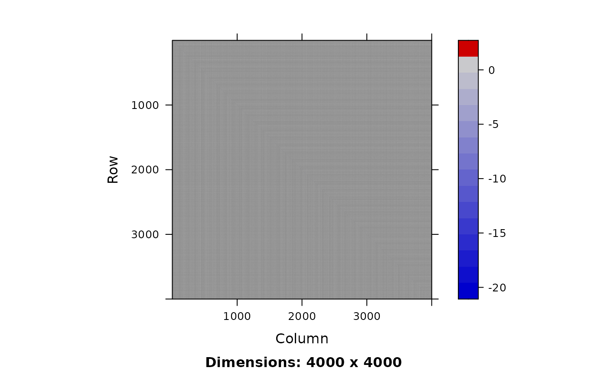
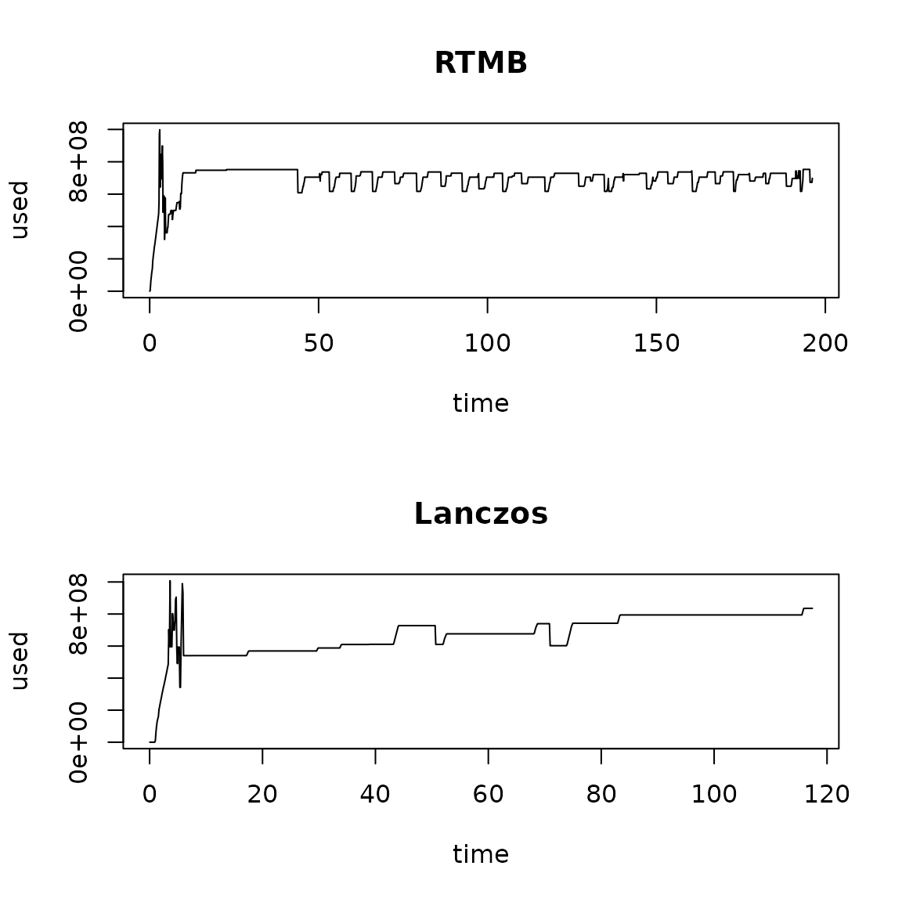

# Lanczos methods for penalized and marginal likelihood models

This vignette demonstrates how Lanczos methods can be used to
approximate standard errors and epsilon bias-correction for penalized
likelihood models, without directly forming or inverting the Hessian
matrix representing associations among random effects.

``` r

library(Matrix)
library(RTMB)
library(lanczosRTMB)
library(numDeriv)
library(memprof)
```

## Generalized linear mixed model

We first demonstrate Lanczos methods using a simple generalized linear
mixed model.

### Simulate from a GLMM

We first simulate data from a compound lognormal-Gamma process:

``` r

set.seed(123)
n = 100
n_sum = 3

# log-linked normal deviates
u = 0 + rnorm(n)

# Conditional gamma process
y = rgamma( n, shape = 1/0.5^2, scale = exp(u) * 0.5^2 )
```

We then define a function to compute the joint likelihood, while also
allowing us to calculate other outputs for later use:

``` r

nll = function(p){
  sumexpu = sum(exp(p$u[seq_len(n_sum)]))
  ADREPORT( sumexpu )
  REPORT( sumexpu )
  nll1 = dnorm(p$u, mean=p$mu, sd=exp(p$logsd), log=TRUE)
  nll2 = dgamma( 
    y, 
    shape = 1/exp(2*p$logcv), 
    scale = exp(p$u) * exp(2*p$logcv), 
    log=TRUE
  )
  jnll = -1 * ( sum(nll1) + sum(nll2) )
  if(what == "jnll") return(jnll)
  if(what == "sumexpu") return(sumexpu)
  if(what == "biascorr") return(jnll + p$eps * sumexpu)
}

# Starting list of parameters
parlist = list(u=u*0, mu = 0, logsd = 0, logcv = 0)
```

Finally, we fit this model as a log-linked generalized linear mixed
model (GLMM):

``` r

# Build RTMB object
what = "jnll"
obj = RTMB::MakeADFun( 
  nll, 
  parlist,
  random = "u",
  profile = "mu",
  silent = TRUE
)

# optimize 
opt = nlminb( obj$par, obj$fn, obj$gr )
opt
#> $par
#>      logsd      logcv 
#> -0.2336439 -0.3417072 
#> 
#> $objective
#> [1] 149.7827
#> 
#> $convergence
#> [1] 0
#> 
#> $iterations
#> [1] 11
#> 
#> $evaluations
#> function gradient 
#>       14       11 
#> 
#> $message
#> [1] "both X-convergence and relative convergence (5)"
```

### Fit as marginal likelihood without Cholesky decomposition

We first show that we can re-fit the model using the marginal
likelihood, evaluated using Hutchinson-Lanczos instead of the Cholesky
factorization that is default in TMB:

``` r

lan_obj = lanczos_MakeADFun(
  nll, 
  parlist,
  random = "u",
  profile = "mu",
  k = 10,
  silent = TRUE,
)

# optimize 
lan_opt = nlminb( 
  lan_obj$par, 
  \(x) lan_obj$fn(x, orthogonalize = FALSE), 
  \(x) lan_obj$gr(x, method = "simple", orthogonalize = FALSE) 
)
lan_opt
#> $par
#>      logsd      logcv 
#> -0.2336601 -0.3417262 
#> 
#> $objective
#> [1] 149.7827
#> 
#> $convergence
#> [1] 1
#> 
#> $iterations
#> [1] 8
#> 
#> $evaluations
#> function gradient 
#>       21        8 
#> 
#> $message
#> [1] "false convergence (8)"
```

### Steps within the Lanczos marginal likelihood calculation

Next, we show that the model can be refitted using penalized likelihood,
conditional upon fixed values for variance parameters:

``` r

# Define RTMB object for penalized likelihood
newmap = list(
  mu = factor(NA), 
  logsd = factor(NA), 
  logcv = factor(NA)
)
pen = RTMB::MakeADFun( 
  nll, 
  obj$env$parList(), 
  map = newmap,
  silent = TRUE
)

# Re-optimize
opt_pen = nlminb( pen$par, pen$fn, pen$gr )
```

Alternatively, we provide a Newton optimizer using a truncated conjugate
gradient, which operates using Hessian-vector products without ever
forming the full Hessian matrix:

``` r

# Extract tape and make Hessian-vector-product function
tape = GetTape(pen)
Hq = make_Hq( tape, pen$par )

# run Newton optimizer
opt_pen2 = newton_CG(
  par = pen$par,
  fn = tape,
  gr = tape$jacfun(),
  Hq = Hq
)
#> value: 179.689 mgc: 1.376677e-14 ustep: 0.9999
```

We can then use stochastic trace estimation and the Lanczos method to
approximate the log-determinant of the Hessian for random effects:

``` r

# log-determinant using Lanczos
Hq = make_Hq( GetTape(pen), opt_pen$par )
lanczos_logdet( Hq, k = 10, m = 3 )
#> [1] 123.9751 123.9751 123.9751

# log-determinant for marginal likelihood
is_random = names(obj$env$last.par.best) %in% "u"
H = obj$env$spHess(par = obj$env$last.par.best)[is_random,is_random]
Matrix::determinant( H )$modulus
#> [1] 123.9751
#> attr(,"logarithm")
#> [1] TRUE
```

Using this log-determinant, we can also compare the log-marginal
likelihood using Lanczos with the full calculation:

``` r

# Marginal likelihoods using Lanczos
lanczos_nll( pen, k = 10, m = 10 )
#>      nll   sd_nll 
#> 149.7827   0.0000

# Marginal likelihood using Laplace
opt$obj
#> [1] 149.7827
```

### Delta methods

After estimating estimating random effects using the penalized
likelihood, we can apply Lanczos methods to standard errors for
parameters conditional upon fixed effect estimates. Here, we will sample
the first three random effects

``` r

samples = lanczos_sample(
   Hq = Hq,
   q = c( rep(1,3), rep(0,n-3) ),
   k = 30,
   n = 1000,
   orthogonalize = TRUE
)

#
sdrep = sdreport( obj, ignore.parm.uncertainty = TRUE )
as.list(sdrep, what = "Std. Error")$u[1:3]
#> [1] 0.6169927 0.5603973 0.4274568
apply( samples, MARGIN = 1, FUN = sd)[1:3]
#> [1] 0.6102670 0.5559250 0.4235736
```

Alternatively, we can apply Lanczos methods to approximate the Hessian
with respect to a derived quantity. This involves calculating the
gradient for the derived quantity with respect to coefficients:

``` r

what = "sumexpu"
grad = RTMB::MakeADFun( 
  nll, 
  obj$env$parList(), 
  map = newmap,
  silent = TRUE
)$gr( pen$par )[1,]
```

We can then use this gradient to approximate samples from the Hessian
matrix and use that to calculate a Monte Carlo estimator for standard
errors:

``` r

samples = lanczos_sample(
   Hq = Hq,
   q = grad,
   k = 30,
   n = 1000,
   orthogonalize = TRUE
)

# Compare SD of samples with the delta method
sumexpu1 = apply( samples, MARGIN = 2, FUN = \(v)pen$report(v)$sumexpu )
c( pen$report()$sumexpu, sd(sumexpu1) )
#> [1] 5.120785 1.242401
summary(sdrep)['sumexpu',]
#>   Estimate Std. Error 
#>   5.120785   1.680983
```

Alternatively, we can calculate the standard error for a derived
quantity using Lanczos within the delta method:

``` r

# 
Var = lanczos_variance(
  Hq = Hq,
  q = grad,
  k = 3
)

# Compare with the delta method
c( pen$report()$sumexpu, sqrt(Var) )
#> [1] 5.120785 1.668657
summary(sdrep)['sumexpu',]
#>   Estimate Std. Error 
#>   5.120785   1.680983
```

### Epsilon methods

Finally, we can use the gradient of the log-likelihood with respect to a
dummy variable epsilon to correct for retransformation bias:

``` r

# One-sided finite difference
what = "biascorr"
phat = obj$env$parList()
phat$eps = 0.0001
newmap$eps = factor(NA)
pen_hi = RTMB::MakeADFun( 
  nll, 
  parameters = phat, 
  map = newmap,
  silent = TRUE
)

# Re-optimize
opt_hi = optim( 
  pen_hi$par, pen_hi$fn, pen_hi$gr, 
  method = "L-BFGS-B", control = list(factr = 1e-2) 
)

# Calculate marginal nll for finite-difference
nll_hi = lanczos_nll( pen_hi, k = 10, m = 10, seed = 123 )
nll_mid = lanczos_nll( pen, k = 10, m = 10, seed = 123 )

# Epsilon bias-correction estimator
what = "jnll"
sdrep = sdreport( obj, bias.correct = TRUE )

#
(nll_hi['nll'] - nll_mid['nll']) / (phat$eps)
#>      nll 
#> 6.050397
summary(sdrep)['sumexpu',]
#>            Estimate          Std. Error Est. (bias.correct) Std. (bias.correct) 
#>            5.120785            1.801529            6.319429                  NA
```

## Spatial change of support

Next, we fit a model that involves spatial change of support, which
breaks sparsity in the inner Hessian. We again simulate data from the
change-in-support process:

``` r

# Settings
set.seed(123)
nx = 20
ny = 100
rho = 0.9

# Simulate AR1 process approaching random walk (i.e., ill-conditioned inner problem)
Px = bandSparse( n = nx, k = c(-1,1), diagonals = list(rep(0.5,nx),rep(0.5,nx)) )
Py = bandSparse( n = ny, k = c(-1,1), diagonals = list(rep(0.5,ny),rep(0.5,ny)) )
Ix = Diagonal(n=nx)
Iy = Diagonal(n=ny)
Qx = (Ix - rho * t(Px)) %*% (10 * Ix) %*% (Ix - rho * Px)
Qy = (Iy - rho * t(Py)) %*% (10 * Iy) %*% (Iy - rho * Py)
Q = kronecker( Qy, Qx )
x = RTMB:::rgmrf0( n= 1, Q = Q )[,1]
y = rpois( nx*ny, lambda = exp(1 + x) )
which_seen = sample( seq_len(nx*ny), size = nx*ny * 0.1, replace = FALSE)
sumy = sum(y)
y[-which_seen] = NA
```

We then define the joint likelihood that includes a term for the total
across samples:

``` r

nll = function(p){
  Qx = (Ix - plogis(p$invlogis_rho) * t(Px)) %*% (exp(2*p$logtau) * Ix) %*% (Ix - plogis(p$invlogis_rho) * Px)
  Qy = (Iy - plogis(p$invlogis_rho) * t(Py)) %*% (exp(2*p$logtau) * Iy) %*% (Iy - plogis(p$invlogis_rho) * Py)
  Q = kronecker( Qy, Qx )
  loglik1 = dgmrf(p$x, Q = Q, log = TRUE)
  loglik2 = sum(dpois(y, exp(p$mu + p$x), log=TRUE), na.rm=TRUE)
  loglik3 = dnorm(log(sumy), log(sum(exp(p$mu + p$x))), sd = 0.01, log = TRUE)
  -1 * ( loglik1 + loglik2 + loglik3 )
}
parlist = list( x=rnorm(nx*ny), logtau = 0, invlogis_rho = 0, mu = 0 )
```

We then fit this as normal in RTMB:

``` r

start_time = Sys.time()
fit_RTMB = with_monitor({
  obj_RTMB = MakeADFun(
    nll,
    parlist,
    random = "x",
    silent = TRUE
  )
  nlminb(
    obj_RTMB$par,
    obj_RTMB$fn,
    obj_RTMB$gr,
    control = list(trace = 1)
  )
})
#>   0:     542.25774:  0.00000  0.00000  0.00000
#>   1:     536.49640: 0.0932807 0.00295361 0.108717
#>   2:     530.23269: 0.0350435 0.0412936 0.233888
#>   3:     517.86489: 0.177166 0.0610603 0.481935
#>   4:     497.84209: 0.171880 0.184511  1.04158
#>   5:     473.71958: 0.467116 0.413676  1.47608
#>   6:     464.39616: 0.421001 0.430761  1.37060
#>   7:     461.31103: 0.406345 0.430444  1.31951
#>   8:     456.78188: 0.376005 0.421242  1.21805
#>   9:     456.70440: 0.375181 0.420584  1.21620
#>  10:     456.53734: 0.373507 0.419335  1.21250
#>  11:     456.49887: 0.373153 0.419169  1.21174
#>  12:     456.40602: 0.372432 0.418914  1.21022
#>  13:     456.38219: 0.372282 0.418911  1.20992
#>  14:     456.32221: 0.371979 0.418933  1.20931
#>  15:     455.89572: 0.371367 0.419102  1.20810
#>  16:     455.85064: 0.371355 0.419110  1.20808
#>  17:     455.70728: 0.371330 0.419128  1.20804
#>  18:     455.66056: 0.371325 0.419131  1.20803
#>  19:     455.51635: 0.371316 0.419138  1.20801
#>  20:     455.47098: 0.371314 0.419140  1.20801
#>  21:     455.33733: 0.371310 0.419142  1.20800
#>  22:     455.29764: 0.371309 0.419143  1.20800
#>  23:     455.18917: 0.371307 0.419144  1.20799
#>  24:     455.15973: 0.371307 0.419144  1.20799
#>  25:     455.08689: 0.371306 0.419145  1.20799
#>  26:     454.78768: 0.371305 0.419146  1.20799
#>  27:     454.62557: 0.371305 0.419146  1.20799
#>  28:     454.57388: 0.371305 0.419146  1.20799
#>  29:     454.42133: 0.371305 0.419146  1.20799
#>  30:     454.37635: 0.371305 0.419146  1.20799
#>  31:     454.24229: 0.371305 0.419146  1.20799
#>  32:     454.20563: 0.371305 0.419146  1.20799
#>  33:     454.11491: 0.371305 0.419146  1.20799
#>  34:     453.25758: 0.371305 0.419146  1.20799
#>  35:     452.97127: 0.371305 0.419146  1.20799
#>  36:     452.64310: 0.371305 0.419146  1.20799
#>  37:     452.64299: 0.371305 0.419146  1.20799
#>  38:     452.64293: 0.371305 0.419146  1.20799
#>  39:     452.64290: 0.371305 0.419146  1.20799
#>  40:     452.64289: 0.371305 0.419146  1.20799
#>  41:     452.64288: 0.371305 0.419146  1.20799
#>  42:     452.64288: 0.371305 0.419146  1.20799
#>  43:     452.64288: 0.371305 0.419146  1.20799
#>  44:     452.64288: 0.371305 0.419146  1.20799
#>  45:     452.64288: 0.371305 0.419146  1.20799
#>  46:     452.64288: 0.371305 0.419146  1.20799
#>  47:     452.64288: 0.371305 0.419146  1.20799
fit_RTMB$run_time = Sys.time() - start_time
```

We can see that the Hessian is dense:

``` r

Matrix::image( obj_RTMB$env$spHess(random=TRUE) )
```



Alternatively, we can fit this using Lanczos methods, which are less
sensitive to the lack-of-sparsity. Here, we avoid constructing the
gradient of the Laplace-Lanczos approximation to the log-marginal
likelihood, pending improvements:

``` r

start_time = Sys.time()
fit_lanczos = with_monitor({
  obj = lanczos_MakeADFun(
    nll,
    parlist,
    random = "x",
    k = 40,
    make_gr = TRUE,
    silent = TRUE
  )
  nlminb(
    obj$par,
    \(x) obj$fn(x, orthogonalize = FALSE),
    \(x) obj$gr(x, method = "simple", orthogonalize = FALSE),
    control = list(trace = 1)
  )
})
#>   0:     504.62809:  0.00000  0.00000  0.00000
#>   1:     499.98677: 0.0790345 0.0214530 0.0573875
#>   2:     444.29862: 0.488155 0.499810 0.986120
#>   3:     428.86168: 0.366784 0.514100  1.53020
#>   4:     428.28345: 0.587673 0.678801  1.57287
#>   5:     415.57575: 0.536487 0.737340  1.45716
#>   6:     410.90042: 0.557378 0.870075  1.21286
#>   7:     402.77754: 0.743637  1.06543  1.28274
#>   8:     399.47667: 0.754201  1.33787  1.22439
#>   9:     394.51788: 0.927797  1.55470  1.20019
#>  10:     394.46111:  1.02882  1.81373  1.17933
#>  11:     394.01701:  1.02277  1.69398  1.18402
#>  12:     393.98757: 0.960705  1.64967  1.16989
#>  13:     393.83663: 0.983058  1.68129  1.16782
#>  14:     393.79585:  1.00172  1.70378  1.16492
#>  15:     393.79580:  1.00112  1.70349  1.16458
#>  16:     393.79578:  1.00111  1.70345  1.16450
#>  17:     393.79577:  1.00111  1.70342  1.16446
#>  18:     393.79574:  1.00111  1.70342  1.16445
#>  19:     393.79567:  1.00111  1.70342  1.16445
#>  20:     393.79567:  1.00111  1.70342  1.16445
fit_lanczos$run_time = Sys.time() - start_time
```

Where we can compare the runtime for the two models:

``` r

runtime = c(
  RTMB = fit_RTMB$run_time,
  Lanczos = fit_lanczos$run_time
)
knitr::kable( runtime, digits=2, caption="Run-times" )
```

|         | x         |
|:--------|:----------|
| RTMB    | 3.06 mins |
| Lanczos | 1.61 mins |

Run-times {.table}

And we can also compare memory use:

``` r

par(mfrow = c(2,1) )
mem1 = memprof:::used_memory_total_by_time(fit_RTMB$memory_use)
mem1[,'used'] = mem1[,'used'] - min(mem1[,'used'])
plot( mem1, type = "l", main = "RTMB")
mem2 = memprof:::used_memory_total_by_time(fit_lanczos$memory_use)
mem2[,'used'] = mem2[,'used'] - min(mem2[,'used'])
plot( mem2, type = "l", main = "Lanczos")
```



which shows that Lanczos uses similar memory:

``` r

max_memory = c(
  RTMB = max(mem1[,'used']) / 1e9,
  Lanczos = max(mem2[,'used']) / 1e9
)
knitr::kable( max_memory, digits=2, caption="Maximum memory use (GB)" )
```

|         |    x |
|:--------|-----:|
| RTMB    | 0.96 |
| Lanczos | 1.00 |

Maximum memory use (GB) {.table}

Runtime for this vignette: 5.08 mins

### Works cited
